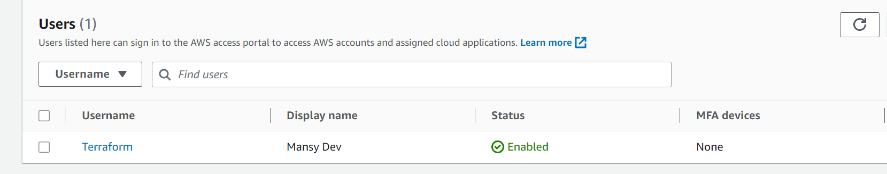

# AUTOMATE INFRASTRUCTURE WITH IAC USING TERRAFORM PART 1

## Table of Contents
- [Introduction](#introduction)
- [prerequisites](#prerequisites)
- [Create an S3 bucket](#create-an-s3-bucket)
- [Creating our Terraform project](#creating-our-terraform-project)
    - [Setup Terraform CLI](#setup-terraform-cli)
    - [Provider and VPC resource section](#provider-and-vpc-resource-section)
    - [Subnets resource section](#subnets-resource-section)
    - [Observations](#observations)


## Introduction
In the previous project, we manually implemented an AWS Infrastructure as Code. In this project, we will automate the infrastructure using Terraform. Terraform is an open-source infrastructure as code (IaC) tool created by HashiCorp. Users define and provide data center infrastructure using a declarative configuration language known as HashiCorp Configuration Language, or optionally JSON. Terraform generates an execution plan describing what it will do to reach the desired state and then executes it to build the described infrastructure. As the configuration changes, Terraform can determine what changed and create incremental execution plans which can be applied.


## Prerequisites
- AWS Account
- AWS CLI installed and configured
- Create an IAM user and name it terraform and ensure you grant it AdministratorAccess permissions also grant it programmatic access
- Configure programmatic access from your local machine to connect to AWS using the access keys generated for the user and a python sdk called boto3.

[Here is a guide on how to create an IAM user and grant it programmatic access](https://docs.aws.amazon.com/IAM/latest/UserGuide/id_users_create.html)

[Guide to configure AWS on your local machine using boto3](https://boto3.amazonaws.com/v1/documentation/api/latest/guide/quickstart.html)

result:


## Create an S3 bucket
- Create an s3 bucket to store our Terraform state file.
    - You can name it something like '<yourname>-dev-terraform-bucket'
    Note: Names must be unique within a region partition.
    - Navigate to the S3 service and create a bucket.
    - Select the region you want to use.
    - Specify your bucket name according to the naming convention specified earlier.
    - Ensure you leave block all public access to the bucket checked.
    - Enable bucket versioning.
    - Specify the tag: which can be the name of the bucket.
    - Click on create bucket.


    result:
    

- To check if our aws cli is configured correctly, run the following command:
    ```bash
    aws s3 ls
    ```
    result:
    


## Creating our Terraform project

We would be creating a directory structure for our project.

- Create a folder called PBL
    ```bash
    mkdir PBL
    ```
- Create a file in the folder and name it main.tf
    ```bash
    cd PBL
    touch main.tf
    ```
result:


### Setup Terraform CLI
Set up Terraform CLI on your local machine. [Here is a guide on how to do that](https://learn.hashicorp.com/tutorials/terraform/install-cli)

### Provider and VPC resource section
- Add AWS as a provider, and a resource to create a VPC in the main.tf file.
- Provider block informs Terraform that we intend to build infrastructure within AWS.
- Resource block will create a VPC.
    ```tf
    provider "aws" {
        region = "us-east-1"
    }

    # create a VPC
    resource "aws_vpc" "main" {
        cidr_block = "172.16.0.0/16"
        enable_dns_support = "true"
        enable_dns_hostnames = "true"
        enable_classiclink = "false"
        enable_classiclink_dns_support = "false"
    }
    ```
    result:
    

- Initialize Terraform to download the AWS provider plugin.
    ```bash
    terraform init
    ```
    result:
    

- Moving on, let us create the only resource we just defined. aws_vpc. But before we do that, we should check to see what terraform intends to create before we tell it to go ahead and create it.
    ```bash
    terraform plan
    ```
    result:
    

- Then, if you are happy with changes planned, execute 'terraform apply' to create the resource.
    ```bash
    terraform apply --auto-approve
    ```
    result:
    


### Subnets resource section
According to our architectural design, we require 6 subnets:
- 2 public subnets
- 2 private subnets for webservers
- 2 private subnets for data layer

- Let's create the 2 public subnets. Add the following configuration to the main.tf file.
    ```tf
    # Create public subnets1
    resource "aws_subnet" "public1" {
        vpc_id                  = aws_vpc.main.id
        cidr_block              = "172.16.0.0/24"
        map_public_ip_on_launch = true
        availability_zone       = "us-east-1a"
    }

    # Create public subnets2
    resource "aws_subnet" "public2" {
        vpc_id                  = aws_vpc.main.id
        cidr_block              = "172.16.1.0/24"
        map_public_ip_on_launch = true
        availability_zone       = "us-east-1b"
    }
    ```

    Note: We are creating 2 subnets, which involves declaring 2 resource blocks, one for each of the subnets. We are also using the vpc_id argument to specify the VPC we created earlier. We are also specifying the cidr_block, map_public_ip_on_launch and availability_zone arguments.

    result:
    

    - Then run terraform plan to see what terraform intends to create.
        ```bash
        terraform plan
        ```
        result:
        

    - Run terraform apply to create the resources.
        ```bash
        terraform apply --auto-approve
        ```
        result:
        

### Observations
- If we look through our current terraform setup, we would notice the following
    - We have hard-coded most of the values in our configuration.
    - We have declared multiple resource blocks for each subnet in the code which is not DRY(Do-Not-Repeat-Yourself).
- We would have to work on refactoring our code to make it more dynamic and reusable.

- Let's destroy our current setup before we refactor. Note: do not destroy an infrastructure you are using in production.
    ```bash
    terraform destroy --auto-approve
    ```

    result:
    